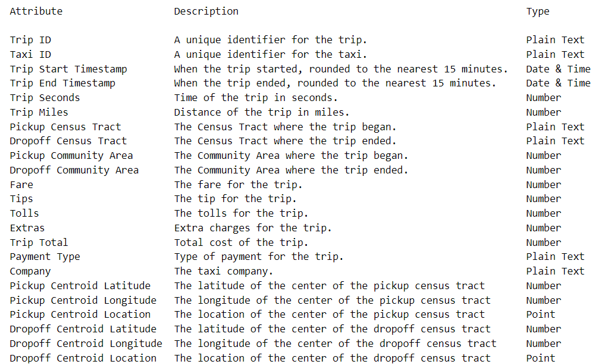
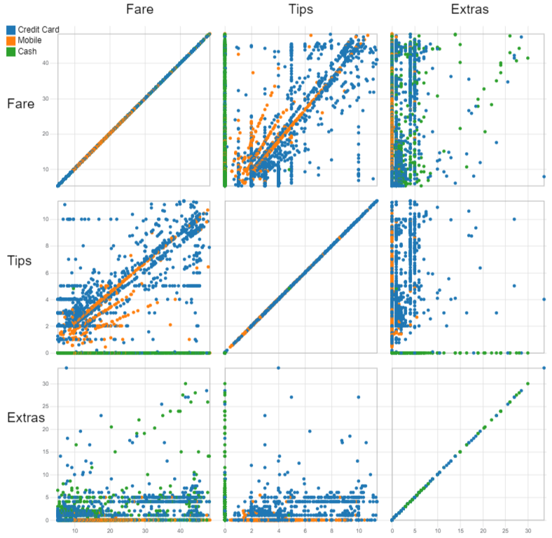
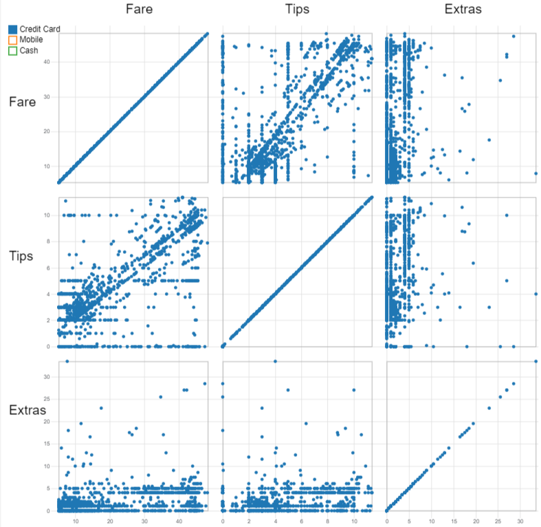
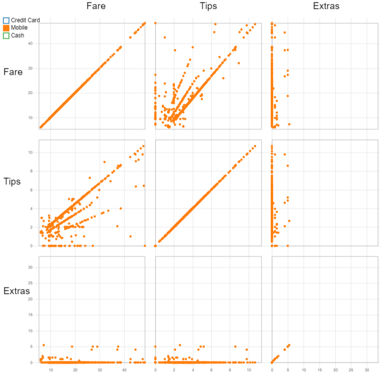
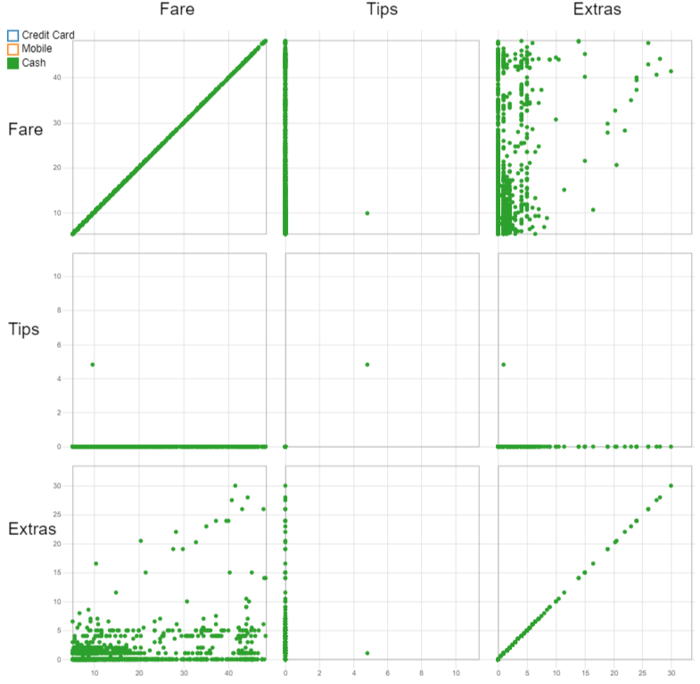
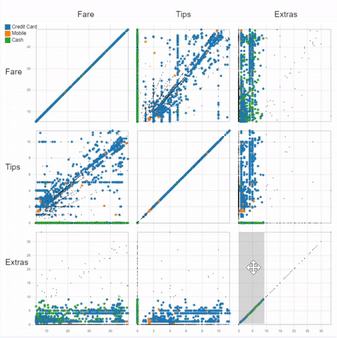
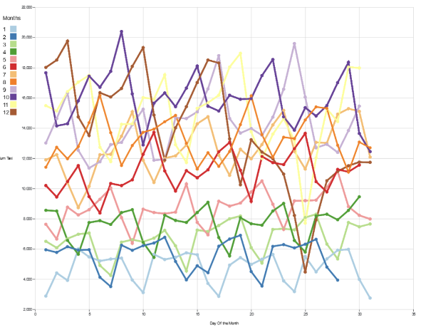
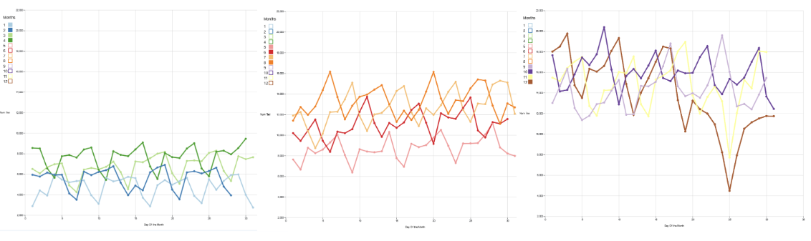

Link to our Observable Notebooks:

Interactive Line Graph:
https://observablehq.com/d/ef54ccc18d2fa9fb

Brushable Matrix Scatter Plot
https://observablehq.com/d/126adc4a04817197

Dataset:

For this project we are using the taxi trips dataset. We choose this dataset because it has a lot of different numerical attributes to which we can compare with.

Total Number of Attributes: 26

Taxi trips reported to the City of Chicago, the dataset is heavy and characterised by 26 columns, the following reported are the ones used for our analysis

Features:
Trip ID: unique identifier for the trip
Taxi ID: unique identifier for the taxi
Trip start Timestamp: when the trip started
Fare : fare for the trip
Tips : tip for the trip 
Payment Type : type of payment for the trip

All data was filtered thanks the usage of Pandas, due to the restriction on the maximum uploading dimension on Observable (50MB). Before the filtering operations , we removed NaN and null values. Then the useless columns were removed and data were grouped according to the purpose of the visualization. After on observable the data were mapped to specific objects in order to get the different plots.

Questions:

Question 1:
    Is there any correlation between the extra charges and fare/tips? do they differ based on payment methods? 

Question 2:
    How do people tip when compared to fare charged and payment method?

Question 3:
    How has the amount of taxi taken changed during the year 2021, immediately after the Covid-19 restrictions?
    
Question 4:
    What are the most active taxi companies in Chicago, and in which community areas do they are more active? 

Figure 1:

The matrix scatterplot shows the behaviour of the fare and tips and extra charges amounts on a 3x3 matrix.
We choose this because we felt it was easiest way to visualize and compare 3 values at once. 

The color encodes the different type of payments: Credit Card, Mobile and Cash
we choose this so it would be easier to see trends based on payment type.

The graph's legend is also interactive, clicking on a square filters the data and removes none selected squares.
We choose this to help solve the problem of over plotting

Figure 2:

By seperating the graph into different encodings we can more easily see the trends of different attributes
to answer the questions we asked before

Question 2:
    How do people tip when compared to fare charged and payment method?

The preferred way of payment is the credit card type, as shown from the majority of blue dots

Horizontal rows show fixed amounts for the tips, like 1,2,3 or 5 $, independently from the fare amount 

For mobile payments we can see a linear behaviour for the tips, 
probably due to the possibility on choosing the % of tips according to the fair (18%, 20%, 25%)

For the Cash payments the tips is always zero, probably because there is no track of these.

Multi-View Interaction:

Thanks the usage of a brushing operation is possible to select specific range of data. It will result with a window on which the dots are colored with respect to the remaining ones that will be filled with a blackcolor. These dots will be highligted on every graph. However brushing over any of the [Fare vs Fare, Tips vs Tips, or Extra vs Extra] graphs, the brush + graph acts like a slider, moving up or down a value and showing it's respective dots associated with it. 

With this we can see trends based on amounts of attributes to answer our question.

Question 1:
    Is there any correlation between the extra charges and fare/tips? do they differ based on payment methods? 

Here we see a sliding brush example when looking at increasing extra charges

What we see is that there is no correlation between	 higher extra charges and the amount of tips/fare is charged, values seem to spread out all over the place with no noticable trend. What we do see is that Mobile payments have the smallest amounts of extra charges.

Single-View Interaction:

The plot used to analyse this kind of behaviour is a multiline plot in which each colored line encodes a specific month of the year. On the y axis is reported the number of rides, while on the x axis, the different days of the month. 

This kind of representation fits perfectly for timeseries and quantity values as the one described before.
Thanks the usage of the colored squares on the left, is possible to select or uncheck a specific month to make it appear in the visualization.

This also helps with overplotting

With this we can create charts to compare months together like so

With this we can view trends easier now that overplotting is not an issue

Question 3:
    How has the amount of taxi taken changed during the year 2021, immediately after the Covid-19 restrictions?

For the first four months the number of taxi rides was low, probably due to the restrictions, so taxi were taken only by workers in this period.

Overall increasing in the number of taxi rides in the next fourth months of the year, probably to the easing of restrictions.

Increasing in the number of taxi, except for two quick decrease on Christmas day and the day after the Thanksgiving.

Multi-view spatial plot: 

In this plot we try to analyze the activity of each taxi company with respect to the different community areas. An interactive map of Chicago allow the user to select between the different areas. According to the selection, a barchart on the right will show the amount of taxi for each company in that specific zone (considering the number of pick-up and drop-off). Thanks this representation we see that the most active company is "Taxi Affiliation Services". After the selection of the desired areas is possible to see the amount of taxi going over the bar with the mouse pointer. On the y axis are reported all the taxi companies, while on the x axis, the total amount of taxi. Is also possible to select a specific company by clicking on the corresponding bar in the barchart; in this case in the map will be shown the community areas on which the company has more pick-up and drop-off. This is possible thanks the usage of gradient colors in order to distinguish between the most active areas. This plot is shown in the following images.  

Question 4: 
Thanks this interactive plot is possible to see the behaviour of the different companies around the city of Chicago. 

Website: 
All previous plots were then grouped together in a website, developed thanks the usage of Visual Code and Netlify. A starting interface allow the user to select between the three different plots. Once a plot is selected, is given the possibility to go back to the starting interface. The link is the following: https://424-jesus-davide.netlify.app/
In the following images are shown the pages of the website with the related plots. 

Conclusion:
Thanks to the visualizations proposed we were able to answer to the questions introduced at the beginning.
With the first plot we were able to see a majority of payments done through credit card and the different kind of tips related to the amount of money the method used to pay. We also saw the lack of correlation between extra charges, fare, and tips.
The connected scatterplot in the second case allow us to track the flow of taxi rides during an entire year. We are able to analyse different months together looking for interesting points characterised by big increase or decrease in the amount of rides provided during 2021.
The multi view spatial plot allow us to answer the question about the most active companies in Chicago. 
The website was created in order to group everything together, showing the different plots developed for project 2 and 3. 

